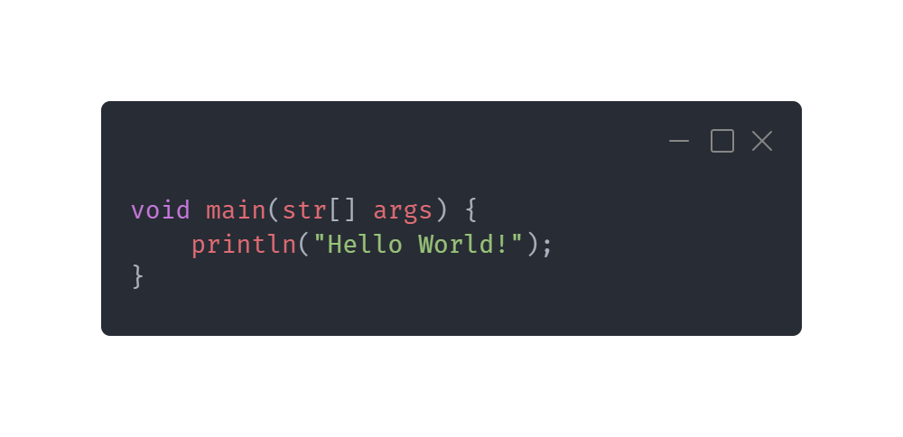

<a href="examples/HelloWorld.cys"></a>

<p align="center">
    <a href="https://github.com/PryosCode/Cinyras/wiki/Installation"></a>
    <a href="https://github.com/PryosCode/Cinyras/releases"></a>
    <a href="https://hub.docker.com/r/pryoscode/cinyras"></a>
    <a href="https://github.com/PryosCode/Cinyras/blob/master/LICENSE"></a>
    <a href="https://discord.gg/bF2GRHq"></a>
</p>

# Cinyras

Cinyras is a [high level](https://en.wikipedia.org/wiki/High-level_programming_language) [general purpose](https://en.wikipedia.org/wiki/General-purpose_programming_language) [interpreted](https://en.wikipedia.org/wiki/Interpreted_language) [scripting](https://en.wikipedia.org/wiki/Scripting_language) language with its own [interpreter](<https://en.wikipedia.org/wiki/Interpreter_(computing)>).

_The interpreter is not production ready and is mainly intended for small programs. Updates could easily break your code._

## Installation

[Wiki](https://github.com/PryosCode/Cinyras/wiki/Installation)

## Test Installation

### Input

```bash
cinyras https://github.com/PryosCode/Cinyras/raw/master/examples/HelloWorld.cys
```

### Output

```
Hello World!
```

## How to use

```
USAGE:
    cinyras [FLAGS] <FILE> [ARGS]...

FLAGS:
    -h, --help       Prints help information
    -V, --version    Prints version information
    -v, --verbose    Use verbose output

ARGS:
    <FILE>       Sets the input file to use
    <ARGS>...    Arguments passed to script
```

## Comparison

### Cinyras

```
void main(str[] args) {
    println("Hello World!");
}
```

### C++

```cpp
#include <iostream>
int main(int argc, char *argv[]) {
    std::cout << "Hello World!" << std::endl;
    return 0;
}
```

### Java

```java
public class Main {
    public static void main(String[] args) {
        System.out.println("Hello World!");
    }
}
```

## License

[Apache License 2.0](LICENSE)